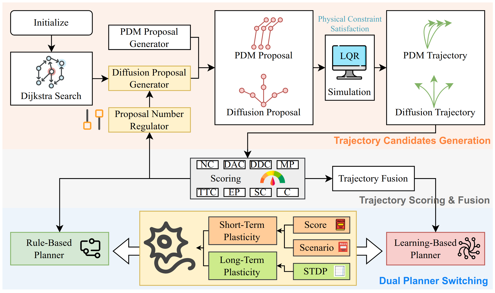

<div align="center">
  
# SAH-Drive: A Scenario-Aware Hybrid Planner for Closed-Loop Vehicle Trajectory Generation

International Conference on Machine Learning (ICML), 2025

[**[Arxiv]**](https://arxiv.org/pdf/2505.24390) [**[Project Page]**](https://sah-drive-web.github.io/)
</div>


### Abstract


Reliable planning is crucial for achieving autonomous driving. Rule-based planners are efficient but lack generalization, while learning-based planners excel in generalization yet have limitations in real-time performance and interpretability. In long-tail scenarios, these challenges make planning particularly difficult. To leverage the strengths of both rule-based and learning-based planners, we proposed the Scenario-Aware Hybrid Planner (SAH-Drive) for closed-loop vehicle trajectory planning. Inspired by human driving behavior, SAH-Drive combines a lightweight rule-based planner and a comprehensive learningbased planner, utilizing a dual-timescale decision neuron to determine the final trajectory. To enhance the computational efficiency and robustness of the hybrid planner, we also employed a diffusion proposal number regulator and a trajectory fusion module. The experimental results show that the proposed method significantly improves the generalization capability of the planning system, achieving state-of-the-art performance in interPlan, while maintaining computational efficiency without incurring substantial additional runtime.


### Environment Setup

Install `nuplan-devkit`, `interPlan`, and `tuplan_garage`.

#### Install `nuplan-devkit`

```bash
cd nuplan-devkit
conda env create -f environment.yml
conda activate nuplan 
pip install -r requirements.txt
pip install -r requirements_torch.txt
pip install -e .
```
The required third-party libraries for the project have been modified from the original NuPlan Devkit to ensure compatibility with Ubuntu 22.04.

#### Install `tuplan_garage`

```bash
cd tuplan_garage
pip install -r requirements.txt
pip install -e .
```

#### Install `interPlan`

```bash
cd interPlan
pip install -e .
```

#### Environment Variables Setup

```bash
# nuplan
export NUPLAN_DATA_ROOT="$HOME/nuplan/dataset"
export NUPLAN_MAPS_ROOT="$HOME/nuplan/dataset/maps"
export NUPLAN_EXP_ROOT="$HOME/nuplan/exp"
export NUPLAN_DEVKIT_ROOT="$HOME/SAH-Drive/nuplan-devkit"
export SAH_ROOT="$HOME/SAH-Drive"
export INTERPLAN_PLUGIN_ROOT="$SAH_ROOT/interPlan"
```
Set the environment variables and move the NuPlan dataset to the corresponding path.


### Train && Test

Switch to the `scripts` folder.

cache train dataset
```bash
cache.sh
```

To train the SAH-Drive model, run:

```bash
train_diffusion_proposal_model.sh
```


### test

The pre-trained model is located in the `SAH_Diffusion_Model` folder.
To run SAH-Drive on `interplan`, run:
```bash
sim_DE_PDM_interplan.sh
```

To run SAH-Drive on `test14-random`, run:
```bash
sim_DE_PDM_test14random.sh
```

To run SAH-Drive on `test14-hard`, run:
```bash
sim_DE_PDM_test14hard.sh
```

To run SAH-Drive on `val14`, run:
```bash
sim_DE_PDM_val14.sh
```

To validate the SAH paradigm combined with either PlanTF+PDM or Pluto+PDM, simply run the corresponding code after installing the required components.

#### Installing PlanTF

PlanTF has been refactored into a standalone third-party Python package. To install it, run the following commands:

```bash
cd planTF
pip install -r requirements.txt
pip install -e .
```

#### Installing Pluto

Pluto shares the same dependencies as PlanTF, so there is no need to reinstall them. To install Pluto:

```bash
cd pluto
pip install -e .
```

### docker

run docker container
```bash
docker build -t  sah-drive:latest .
docker run --gpus all -p 5006:5006 -v $HOME/nuplan:/root/nuplan --name sah_docker -it sah-drive:latest /bin/bash
```

run according code
```bash
cd /root/SAH-Drive
scripts/sim_DE_PDM_interplan.sh
```

### Acknowledgements

This code is largely based off [nuplan-devkit](https://github.com/motional/nuplan-devkit), [tuplan_garage](https://github.com/autonomousvision/tuplan_garage), [planTF](https://github.com/jchengai/planTF), [pluto](https://github.com/jchengai/pluto), [Diffusion-ES](https://github.com/bhyang/diffusion-es), and [interPlan](https://github.com/mh0797/interPlan). Special thanks to the respective authors for making this work possible!

If you do find this code useful in your own research, you can cite the paper:
```biblatex
@misc{fan2025sahdrivescenarioawarehybridplanner,
      title={SAH-Drive: A Scenario-Aware Hybrid Planner for Closed-Loop Vehicle Trajectory Generation}, 
      author={Yuqi Fan and Zhiyong Cui and Zhenning Li and Yilong Ren and Haiyang Yu},
      year={2025},
      eprint={2505.24390},
      archivePrefix={arXiv},
      primaryClass={cs.RO},
      url={https://arxiv.org/abs/2505.24390}, 
}
```
